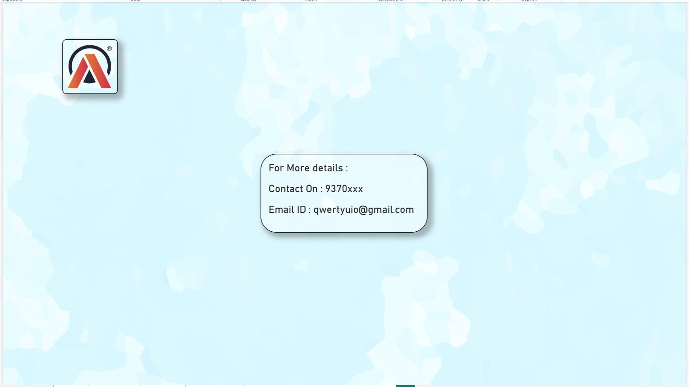

# Atliq Global Sales & Shipment Analytics – Power BI Dashboard

## Overview

This Power BI project provides a comprehensive view of company performance across Sales, Finance, Marketing, Supply Chain, and Executive Information.
It integrates data from multiple databases to deliver real-time insights into sales trends, forecasting accuracy, cost structures, and international shipment performance.

🏢 Project Objective

- To build a unified analytical solution that helps stakeholders:

- Monitor global sales and market performance

- Track forecast vs. actual sales for demand accuracy

- Analyze freight, manufacturing, and deduction costs to evaluate margins

- Visualize customer and product profitability across international markets

- Provide department-specific insights via dedicated Power BI views

🗄️ Data Sources

The project integrates data from two databases:

1️⃣ gdb041 – Core Sales Data
Table	Description
dim_customer	Customer master data including region, market, and key attributes
dim_market	Market and region hierarchy for global sales segmentation
dim_product	Product catalog with category and hierarchy details
fact_forecast_monthly	Monthly forecast data used for demand accuracy analysis
fact_sales_monthly	Actual monthly sales facts with quantities, values, and metrics

2️⃣ gdb056 – Cost & Pricing Data
Table	Description
freight_cost	Freight and shipment cost details by region and product
gross_price	Product-level pricing before deductions
manufacturing_cost	Cost of goods manufactured (COGM) per unit
post_invoice_deductions	Deductions applied after invoicing (e.g., rebates, returns)
pre_invoice_deductions	Deductions applied before invoicing (e.g., trade discounts)
🧩 Data Model

The two databases are linked through common dimensions (Customer, Product, and Market).
A star schema model ensures optimized performance and analytical consistency across visuals.

Key Relationships:

dim_customer ↔ fact_sales_monthly

dim_product ↔ fact_sales_monthly, manufacturing_cost, gross_price

dim_market ↔ freight_cost, fact_sales_monthly

fact_forecast_monthly joined to fact_sales_monthly by product/month for variance tracking

## 📈 Power BI Views (Dashboards)

The dashboard includes five navigable views, each designed for a specific business function:

View	Focus	and  Key Insights

**Sales View**	Regional & product-level sales performance	Actual vs. Forecast, Top/Bottom markets, Growth trends.

**Marketing View**	Market share and promotional impact	Market segmentation, campaign ROI, sales uplift.

**Finance View**	Revenue, cost, and profitability tracking	Net margin, deductions, freight & manufacturing costs

**Supply Chain View**	Logistics and shipment analysis	Freight cost trends, delivery efficiency, demand vs. supply

**Information View**	Quick info and contact details

Each view links seamlessly via navigation buttons, ensuring smooth exploration across departments.

⚙️ Technical Highlights

Data Model: Star schema with relational joins between fact and dimension tables

ETL Logic: Data cleaned and transformed in Power Query (merge, append, custom measures)

KPIs Used: Revenue, Forecast Accuracy, Gross Margin %, Freight Cost %, Net Profit

DAX Measures: Time intelligence, cumulative totals, YoY comparisons

🚀 Business Impact

Reduced manual report preparation by through automation

Enhanced profitability visibility at SKU and regional levels

Enabled data-driven decisions for pricing, logistics, and marketing spend